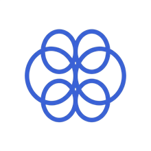

# 🧠 Summer 2026 Offer & Interview Reports

Track where candidates are reporting Summer 2026 offers, interviews, online assessments, and rejections across software, data science, quant, AI, hardware, and more.

Maintained from Discord `!process` reports and paired with InterviewSense so you can prep around the companies that are actually moving right now.

      

🧠 For practical tips on navigating the internship process, check out the guide: [Zero to Offer](ZERO_TO_OFFER.md)

🙏 Contribute by submitting an [issue](https://github.com/interviewsense/2026-Summer-Intern-Process-Tracker/issues). See the contribution guidelines [here](CONTRIBUTING.md).

---

## Browse 5,867 Process Reports by Signal

🎉 **Offer reports** (378)

🎙️ **Interview reports** (1,118)

📝 **OA mentions** (223)

💀 **Rejection reports** (167)

---

<strong>😤 Struggling with interviews at these companies?</strong>

<a href="https://interviewsense.org"><strong>Get AI mock interviews built around every company in this list</strong></a>

<em>Stop grinding random LeetCode. InterviewSense builds mock interviews around the real offer, OA, and interview patterns candidates are reporting right now.</em>

---

## 📡 Companies (Newest → Oldest)

| Company | Offers | Interviews | OAs | Last Active | Prep |
|---------|--------|------------|-----|-------------|------|
| **Amazon** | `96` | `369` | `56` | `2026-04-29` |  |
| **OpenAI** | `8` | `28` | `7` | `2026-04-29` |  |
| **SpaceX** | `8` | `2` | `1` | `2026-04-29` |  |
| **Optiver** | `4` | `16` | `0` | `2026-04-29` |  |
| **Palantir** | `2` | `3` | `1` | `2026-04-29` |  |
| **xAI** | `1` | `5` | `1` | `2026-04-29` |  |
| **Notion** | `0` | `9` | `0` | `2026-04-29` |  |
| **TikTok** | `0` | `4` | `6` | `2026-04-29` |  |
| **Tesla** | `3` | `28` | `0` | `2026-04-28` |  |
| **Pinterest** | `1` | `1` | `2` | `2026-04-28` |  |
| **Verkada** | `0` | `1` | `1` | `2026-04-28` |  |
| **Stoke** | `0` | `1` | `0` | `2026-04-28` |  |
| **Forward Networks** | `0` | `1` | `0` | `2026-04-28` |  |
| **Genesis Molecular** | `0` | `0` | `0` | `2026-04-28` |  |
| **ByteDance** | `0` | `0` | `0` | `2026-04-28` |  |
| **Nvidia** | `10` | `26` | `0` | `2026-04-27` |  |
| **Ramp** | `3` | `12` | `4` | `2026-04-27` |  |
| **Shopify** | `3` | `0` | `1` | `2026-04-27` |  |
| **Snowflake** | `2` | `10` | `3` | `2026-04-27` |  |
| **Box** | `0` | `3` | `1` | `2026-04-27` |  |
| **Point72** | `0` | `2` | `1` | `2026-04-27` |  |
| **Capital One** | `12` | `16` | `4` | `2026-04-24` |  |
| **Cisco** | `2` | `11` | `0` | `2026-04-24` |  |
| **Strava** | `0` | `2` | `0` | `2026-04-24` |  |
| **Arrowstreet Capital** | `0` | `2` | `0` | `2026-04-24` |  |
| **IBM** | `55` | `87` | `2` | `2026-04-23` |  |
| **Jane Street** | `1` | `9` | `0` | `2026-04-23` |  |
| **Zoox** | `1` | `5` | `2` | `2026-04-23` |  |
| **Aurora** | `0` | `4` | `0` | `2026-04-23` |  |
| **IMC** | `0` | `3` | `3` | `2026-04-23` |  |
| **Scale AI** | `0` | `2` | `1` | `2026-04-22` |  |
| **Crusoe** | `0` | `0` | `0` | `2026-04-22` |  |
| **Cloudflare** | `6` | `6` | `0` | `2026-04-21` |  |
| **Citadel** | `4` | `18` | `3` | `2026-04-21` |  |
| **LinkedIn** | `3` | `8` | `3` | `2026-04-21` |  |
| **Okta** | `0` | `4` | `4` | `2026-04-21` |  |
| **Appian** | `0` | `0` | `0` | `2026-04-21` |  |
| **C3 AI** | `0` | `1` | `0` | `2026-04-20` |  |
| **Alibaba** | `0` | `0` | `0` | `2026-04-20` |  |
| **Netflix** | `3` | `2` | `1` | `2026-04-19` |  |
| **Apple** | `9` | `31` | `1` | `2026-04-18` |  |
| **Texas Instruments** | `0` | `2` | `0` | `2026-04-18` |  |
| **Rocket Lab** | `0` | `0` | `0` | `2026-04-18` |  |
| **Fifth Third Bank** | `0` | `0` | `0` | `2026-04-18` |  |
| **Google** | `16` | `13` | `3` | `2026-04-17` |  |
| **Expedia** | `2` | `11` | `1` | `2026-04-17` |  |
| **Neuralink** | `0` | `0` | `0` | `2026-04-17` |  |
| **Bloomberg** | `0` | `0` | `0` | `2026-04-17` |  |
| **Salesforce** | `2` | `3` | `1` | `2026-04-15` |  |
| **Docusign** | `2` | `3` | `0` | `2026-04-15` |  |
| **Sierra Space** | `0` | `3` | `3` | `2026-04-15` |  |
| **Pure Storage** | `1` | `0` | `4` | `2026-04-12` |  |
| **HP** | `0` | `0` | `0` | `2026-04-12` |  |
| **Visa** | `23` | `42` | `16` | `2026-04-10` |  |
| **Roblox** | `3` | `2` | `0` | `2026-04-10` |  |
| **SIG** | `3` | `8` | `0` | `2026-04-09` |  |
| **Analysis Group** | `1` | `0` | `0` | `2026-04-09` |  |
| **Brex** | `0` | `0` | `0` | `2026-04-09` |  |
| **Microsoft** | `14` | `13` | `3` | `2026-04-04` |  |
| **Doordash** | `1` | `2` | `0` | `2026-04-04` |  |
| **Ebay** | `1` | `8` | `2` | `2026-04-03` |  |
| **Lyft** | `1` | `0` | `0` | `2026-04-03` |  |
| **SoFi** | `3` | `2` | `1` | `2026-04-02` |  |
| **Jump** | `0` | `0` | `0` | `2026-04-01` |  |
| **Bridgewater** | `0` | `0` | `0` | `2026-04-01` |  |
| **PayPal** | `4` | `5` | `3` | `2026-03-31` |  |
| **Oracle** | `3` | `12` | `0` | `2026-03-31` |  |
| **Klaviyo** | `1` | `1` | `0` | `2026-03-31` |  |
| **HRT** | `0` | `15` | `2` | `2026-03-31` |  |
| **ARM** | `2` | `2` | `0` | `2026-03-30` |  |
| **Palo Alto Networks** | `0` | `0` | `0` | `2026-03-29` |  |
| **AT&T** | `4` | `6` | `1` | `2026-03-27` |  |
| **Akuna** | `0` | `1` | `3` | `2026-03-27` |  |
| **Reddit** | `0` | `0` | `0` | `2026-03-27` |  |
| **Disney** | `3` | `2` | `0` | `2026-03-26` |  |
| **Riot Games** | `0` | `2` | `0` | `2026-03-26` |  |
| **Waymo** | `0` | `0` | `0` | `2026-03-26` |  |
| **Two Sigma** | `1` | `12` | `2` | `2026-03-25` |  |
| **Intuit** | `3` | `8` | `6` | `2026-03-23` |  |
| **Coinbase** | `2` | `2` | `1` | `2026-03-23` |  |
| **Meta** | `3` | `2` | `0` | `2026-03-22` |  |
| **Snapchat** | `3` | `4` | `0` | `2026-03-19` |  |
| **Robinhood** | `1` | `0` | `0` | `2026-03-18` |  |
| **Wells Fargo** | `5` | `1` | `0` | `` |  |
| **Stripe** | `4` | `2` | `5` | `` |  |
| **CVS** | `4` | `2` | `0` | `` |  |
| **GitHub** | `3` | `7` | `0` | `` |  |
| **AMD** | `2` | `3` | `0` | `` |  |
| **Palo Alto** | `2` | `1` | `0` | `` |  |
| **Handshake** | `2` | `1` | `0` | `` |  |
| **Ericsson** | `2` | `0` | `0` | `` |  |
| **Rivian** | `1` | `7` | `0` | `` |  |
| **Geico** | `1` | `6` | `1` | `` |  |
| **Qualcomm** | `1` | `6` | `0` | `` |  |
| **Crowdstrike** | `1` | `5` | `1` | `` |  |
| **MongoDB** | `1` | `4` | `0` | `` |  |
| **Harvey** | `1` | `4` | `0` | `` |  |
| **The Trade Desk** | `1` | `3` | `0` | `` |  |
| **HubSpot** | `1` | `2` | `6` | `` |  |
| **Cit Sec** | `1` | `2` | `0` | `` |  |
| **Uber** | `1` | `1` | `0` | `` |  |
| **Nokia** | `1` | `1` | `0` | `` |  |
| **Goldman Sachs** | `1` | `0` | `6` | `` |  |
| **Walmart** | `1` | `0` | `0` | `` |  |
| **Applied Materials** | `1` | `0` | `0` | `` |  |
| **Airbnb** | `0` | `6` | `4` | `` |  |
| **Gemini** | `0` | `5` | `0` | `` |  |
| **Dropbox** | `0` | `4` | `6` | `` |  |
| **MathWorks** | `0` | `4` | `1` | `` |  |
| **Patreon** | `0` | `3` | `1` | `` |  |
| **Virtu** | `0` | `3` | `0` | `` |  |
| **Together AI** | `0` | `2` | `2` | `` |  |
| **Rippling** | `0` | `2` | `0` | `` |  |
| **Mechanize** | `0` | `2` | `0` | `` |  |
| **General Motors** | `0` | `2` | `0` | `` |  |
| **DRW** | `0` | `1` | `3` | `` |  |
| **Voyager Technologies** | `0` | `1` | `0` | `` |  |
| **Truth Social** | `0` | `1` | `0` | `` |  |
| **PwC** | `0` | `1` | `0` | `` |  |
| **Paramount** | `0` | `1` | `0` | `` |  |
| **NASA** | `0` | `1` | `0` | `` |  |
| **Kalshi** | `0` | `1` | `0` | `` |  |
| **F5** | `0` | `1` | `0` | `` |  |
| **Deloitte** | `0` | `1` | `0` | `` |  |
| **Carfax** | `0` | `1` | `0` | `` |  |
| **Blizzard** | `0` | `1` | `0` | `` |  |
| **ASML** | `0` | `1` | `0` | `` |  |
| **Arrowstreet** | `0` | `1` | `0` | `` |  |
| **ZipRecruiter** | `0` | `0` | `2` | `` |  |
| **Valk Trading** | `0` | `0` | `1` | `` |  |
| **Pokemon Go** | `0` | `0` | `1` | `` |  |
| **Nuro** | `0` | `0` | `0` | `` |  |
| **Intel** | `0` | `0` | `0` | `` |  |
| **Anthropic** | `0` | `0` | `0` | `` |  |

*Last data build: 2026-04-29T22:00:28.575396Z.*
