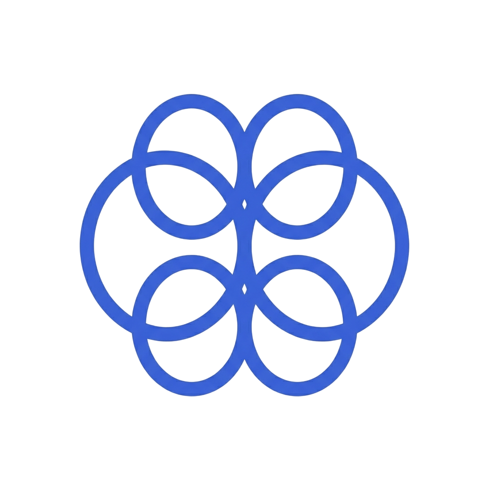

<!-- AUTO-GENERATED - run scripts/generate_readme.py to update -->

# 🧠 2026 Summer Intern Process Tracker

We track every `!process` message in the **2026 Summer Intern Process Discord channel** and turn it into something actually useful — `3,901` reports, `101` companies, scraped and rebuilt every 24 hours.

    

---

### 📡 Browse 610 Recent Reports by Status

🎉 **[Offers Rolling](#offers-rolling)** (18 companies, 359 reports) — companies actively extending offers

🎙️ **[Interviewing](#interviewing)** (33 companies, 153 reports) — companies in active interview rounds

📝 **[OA Wave](#oa-wave)** (10 companies, 43 reports) — companies sending online assessments

💀 **[Rejections Out](#rejections-out)** (7 companies, 14 reports) — recent rejection waves

💬 **[Active](#active)** (21 companies, 39 reports) — companies with recent process activity

---

  <h3>😤 Struggling with interviews at these companies?</h3>
  
<strong><a href="https://interviewsense.org">Get AI mock interviews built around every company in this list</a></strong>

  
    
  
  
<i>Stop grinding random LeetCode. InterviewSense knows which companies are sending OAs right now and builds mock interviews around their actual process — OA patterns, behavioral rounds, quant prep, system design, and more.</i>

---

## 📊 Season at a Glance

| Metric | Count |
|--------|-------|
| 💬 Total process reports | `3,901` |
| 🏢 Companies tracked | `101` |
| 🎙️ Interviews reported | `722` |
| 📝 OAs mentioned | `173` |
| 🎉 Offers reported | `252` |
| 💀 Rejections reported | `114` |

---

## 🔥 Hot Right Now

Most discussed companies since March 1:

- **Amazon** — `195` recent reports — offers rolling 🎉
- **IBM** — `62` recent reports — offers rolling 🎉
- **Visa** — `32` recent reports — offers rolling 🎉
- **Apple** — `21` recent reports — offers rolling 🎉
- **OpenAI** — `21` recent reports — offers rolling 🎉

---

## 📡 Live Status Board

> Synthesized from the last 14 days of process messages. Click the blue **Prep** button on any company to practice that interview on [InterviewSense](https://interviewsense.org).

### 🎉 Offers Rolling

| Company | 14d Reports | Offers | Interviews | OAs | Rejections | Last Active |
|---------|-------------|--------|------------|-----|------------|-------------|
| **Amazon** | `195` | `25` | `67` | `18` | `3` | `today` |
| **IBM** | `62` | `11` | `23` | `0` | `2` | `today` |
| **Visa** | `32` | `4` | `11` | `2` | `0` | `today` |
| **Apple** | `22` | `2` | `5` | `0` | `2` | `today` |
| **Nvidia** | `16` | `3` | `4` | `0` | `0` | `today` |
| **Google** | `12` | `3` | `2` | `0` | `0` | `3 days ago` |
| **Cloudflare** | `7` | `2` | `1` | `0` | `0` | `today` |
| **Capital One** | `6` | `2` | `0` | `0` | `0` | `3 days ago` |
| **SoFi** | `5` | `1` | `0` | `0` | `0` | `2 days ago` |
| **Qualcomm** | `2` | `1` | `0` | `0` | `0` | `3 days ago` |
| **Klaviyo** | `2` | `1` | `0` | `0` | `0` | `3 days ago` |
| **Harvey** | `2` | `1` | `0` | `0` | `0` | `3 days ago` |

### 🎙️ Interviewing

| Company | 14d Reports | Offers | Interviews | OAs | Rejections | Last Active | Prep |
|---------|-------------|--------|------------|-----|------------|-------------|------|
| **OpenAI** | `21` | `0` | `2` | `2` | `0` | `3 days ago` |  |
| **Tesla** | `16` | `0` | `6` | `0` | `1` | `today` |  |
| **Optiver** | `13` | `1` | `6` | `0` | `0` | `2 days ago` |  |
| **Dropbox** | `10` | `0` | `3` | `1` | `1` | `2 days ago` |  |
| **HRT** | `9` | `0` | `4` | `1` | `0` | `1 day ago` |  |
| **Oracle** | `8` | `1` | `2` | `0` | `0` | `3 days ago` |  |
| **Rivian** | `8` | `0` | `4` | `0` | `0` | `3 days ago` |  |
| **HubSpot** | `7` | `0` | `2` | `0` | `0` | `7 days ago` |  |
| **Geico** | `6` | `0` | `1` | `0` | `0` | `today` |  |
| **IMC** | `6` | `0` | `2` | `2` | `0` | `today` |  |
| **LinkedIn** | `5` | `0` | `2` | `0` | `0` | `5 days ago` |  |
| **Snowflake** | `5` | `0` | `2` | `2` | `1` | `today` |  |
| **Okta** | `4` | `0` | `1` | `0` | `1` | `3 days ago` |  |
| **Aurora** | `4` | `0` | `1` | `0` | `0` | `5 days ago` |  |
| **Ramp** | `4` | `1` | `1` | `0` | `1` | `7 days ago` |  |
| **CrowdStrike** | `3` | `0` | `1` | `0` | `0` | `today` |  |
| **Intuit** | `3` | `0` | `1` | `0` | `0` | `today` |  |
| **Jane Street** | `3` | `0` | `1` | `0` | `0` | `today` |  |
| **Akuna** | `2` | `0` | `1` | `0` | `0` | `today` |  |
| **Virtu** | `1` | `0` | `1` | `0` | `0` | `1 day ago` |  |
| **Truth Social** | `1` | `0` | `1` | `0` | `0` | `1 day ago` |  |
| **F5** | `1` | `0` | `1` | `0` | `0` | `1 day ago` |  |
| **Arrowstreet** | `1` | `0` | `1` | `0` | `0` | `today` |  |
| **Kalshi** | `1` | `0` | `1` | `0` | `0` | `today` |  |
| **Carfax** | `1` | `0` | `1` | `0` | `0` | `today` |  |
| **Deloitte** | `1` | `0` | `1` | `0` | `0` | `today` |  |

### 📝 OA Wave

| Company | 14d Reports | Offers | Interviews | OAs | Rejections | Last Active | Prep |
|---------|-------------|--------|------------|-----|------------|-------------|------|
| **Citadel** | `9` | `0` | `0` | `1` | `1` | `3 days ago` |  |
| **Box** | `8` | `0` | `0` | `1` | `0` | `4 days ago` |  |
| **Palantir** | `5` | `0` | `0` | `1` | `0` | `3 days ago` |  |
| **Salesforce** | `2` | `0` | `0` | `1` | `0` | `2 days ago` |  |
| **Pokemon Go** | `1` | `0` | `0` | `1` | `0` | `today` |  |
| **Valk Trading** | `1` | `0` | `0` | `1` | `0` | `today` |  |
| **PayPal** | `1` | `0` | `0` | `1` | `0` | `12 days ago` |  |
| **Goldman Sachs** | `1` | `0` | `0` | `1` | `0` | `13 days ago` |  |

### 💀 Rejections Out

| Company | 14d Reports | Offers | Interviews | OAs | Rejections | Last Active |
|---------|-------------|--------|------------|-----|------------|-------------|
| **IBM** | `1` | `0` | `0` | `0` | `1` | `1 day ago` |
| **Capital One** | `1` | `0` | `0` | `0` | `1` | `1 day ago` |
| **Amazon** | `1` | `0` | `0` | `0` | `1` | `1 day ago` |
| **Microsoft** | `4` | `0` | `0` | `0` | `2` | `6 days ago` |
| **Riot Games** | `3` | `0` | `0` | `0` | `2` | `10 days ago` |
| **Nuro** | `2` | `0` | `0` | `0` | `1` | `3 days ago` |
| **Uber** | `2` | `0` | `0` | `0` | `1` | `11 days ago` |

### 💬 Active

| Company | 14d Reports | Offers | Interviews | OAs | Rejections | Last Active | Prep |
|---------|-------------|--------|------------|-----|------------|-------------|------|
| **TikTok** | `5` | `0` | `0` | `0` | `0` | `3 days ago` |  |
| **Two Sigma** | `4` | `0` | `0` | `0` | `0` | `3 days ago` |  |
| **Akuna** | `3` | `0` | `0` | `0` | `0` | `4 days ago` |  |
| **Pure Storage** | `3` | `0` | `0` | `0` | `0` | `4 days ago` |  |
| **Neuralink** | `2` | `0` | `0` | `0` | `0` | `2 days ago` |  |
| **SpaceX** | `2` | `0` | `0` | `0` | `0` | `2 days ago` |  |
| **Docusign** | `2` | `0` | `0` | `0` | `0` | `3 days ago` |  |
| **ARM** | `2` | `0` | `0` | `0` | `0` | `8 days ago` |  |
| **Stripe** | `2` | `0` | `0` | `0` | `0` | `10 days ago` |  |
| **Sierra Space** | `2` | `0` | `0` | `0` | `0` | `12 days ago` |  |
| **MathWorks** | `2` | `0` | `0` | `0` | `0` | `12 days ago` |  |
| **Roblox** | `1` | `0` | `0` | `0` | `0` | `4 days ago` |  |

---

## 🎉 Recent Offers (March 2026)

| When | Company | What they said |
|------|---------|----------------|
| `today` | **IBM** | IBM SDE offer |
| `today` | **Amazon** | AWS offer |
| `today` | **Amazon** | Zon offer |
| `1 day ago` | **Applied Materials** | Applied Materials offer |
| `3 days ago` | **Qualcomm** | qualcomm swe intern offer if anyone else is joining qualcomm this summer pls dm |
| `3 days ago` | **Capital One** | c1 tip verbal offer |
| `3 days ago` | **Harvey** | harvey offer did anyone try to |
| `4 days ago` | **Amazon** | amazon offer - I also wanna thank everyone who's active here and sharing honest and good i |
| `4 days ago` | **Amazon** | amazon offer |
| `4 days ago` | **Amazon** | zon offer - war is over |
| `4 days ago` | **Google** | openai offer |
| `4 days ago` | **Google** | finally done recruiting after going through hell |
| `4 days ago` | **Zoox** | zoox offer |
| `4 days ago` | **Amazon** | does amazon blacklist if renege offer?? please answer ASAP |

---

## 🏆 Company Leaderboard

Sorted by total all-time reports.

| # | Company | Reports | Offers | Interviews | OAs | Rejections | Offer Rate | Activity |
|---|---------|---------|--------|------------|-----|------------|------------|----------|
| 1 | **Amazon** | `549` | `41` | `189` | `40` | `13` | `7%` | `████████` |
| 2 | **IBM** | `248` | `37` | `78` | `2` | `5` | `15%` | `████░░░░` |
| 3 | **Visa** | `132` | `15` | `35` | `15` | `4` | `11%` | `██░░░░░░` |
| 4 | **Apple** | `112` | `8` | `28` | `1` | `8` | `7%` | `██░░░░░░` |
| 5 | **OpenAI** | `102` | `6` | `23` | `6` | `3` | `6%` | `██░░░░░░` |
| 6 | **Capital One** | `101` | `10` | `16` | `4` | `4` | `10%` | `██░░░░░░` |
| 7 | **Google** | `81` | `14` | `13` | `3` | `2` | `17%` | `█░░░░░░░` |
| 8 | **Nvidia** | `79` | `10` | `24` | `0` | `3` | `13%` | `█░░░░░░░` |
| 9 | **Microsoft** | `70` | `13` | `13` | `3` | `6` | `19%` | `█░░░░░░░` |
| 10 | **Citadel** | `68` | `1` | `18` | `3` | `4` | `1%` | `█░░░░░░░` |
| 11 | **Tesla** | `58` | `1` | `16` | `0` | `1` | `2%` | `█░░░░░░░` |
| 12 | **Stripe** | `57` | `4` | `2` | `5` | `4` | `7%` | `█░░░░░░░` |
| 13 | **Ramp** | `37` | `3` | `10` | `4` | `3` | `8%` | `█░░░░░░░` |
| 14 | **Oracle** | `36` | `3` | `11` | `0` | `1` | `8%` | `█░░░░░░░` |
| 15 | **LinkedIn** | `32` | `1` | `8` | `3` | `8` | `3%` | `█░░░░░░░` |
| 16 | **Two Sigma** | `29` | `1` | `10` | `1` | `0` | `3%` | `░░░░░░░░` |
| 17 | **HRT** | `28` | `0` | `13` | `2` | `0` | `0%` | `░░░░░░░░` |
| 18 | **Snowflake** | `29` | `2` | `7` | `3` | `2` | `7%` | `░░░░░░░░` |
| 19 | **Optiver** | `28` | `4` | `10` | `0` | `0` | `14%` | `░░░░░░░░` |
| 20 | **Intuit** | `29` | `2` | `8` | `6` | `0` | `7%` | `░░░░░░░░` |
| 21 | **Ebay** | `28` | `1` | `8` | `2` | `3` | `4%` | `░░░░░░░░` |
| 22 | **HubSpot** | `27` | `1` | `2` | `6` | `0` | `4%` | `░░░░░░░░` |
| 23 | **Coinbase** | `27` | `2` | `2` | `1` | `1` | `7%` | `░░░░░░░░` |
| 24 | **TikTok** | `25` | `0` | `3` | `6` | `0` | `0%` | `░░░░░░░░` |
| 25 | **Airbnb** | `25` | `0` | `6` | `4` | `1` | `0%` | `░░░░░░░░` |
| 26 | **Palantir** | `24` | `2` | `2` | `1` | `3` | `8%` | `░░░░░░░░` |
| 27 | **Cloudflare** | `24` | `5` | `6` | `0` | `0` | `21%` | `░░░░░░░░` |
| 28 | **Dropbox** | `23` | `0` | `4` | `6` | `1` | `0%` | `░░░░░░░░` |
| 29 | **Jane Street** | `24` | `0` | `7` | `0` | `1` | `0%` | `░░░░░░░░` |
| 30 | **Meta** | `23` | `3` | `2` | `0` | `1` | `13%` | `░░░░░░░░` |
| 31 | **Goldman Sachs** | `21` | `1` | `0` | `6` | `0` | `5%` | `░░░░░░░░` |
| 32 | **Cisco** | `19` | `0` | `9` | `0` | `0` | `0%` | `░░░░░░░░` |
| 33 | **SIG** | `19` | `3` | `6` | `0` | `0` | `16%` | `░░░░░░░░` |
| 34 | **Expedia** | `18` | `2` | `11` | `1` | `1` | `11%` | `░░░░░░░░` |
| 35 | **PayPal** | `18` | `3` | `5` | `3` | `0` | `17%` | `░░░░░░░░` |
| 36 | **MathWorks** | `17` | `0` | `4` | `1` | `0` | `0%` | `░░░░░░░░` |
| 37 | **Geico** | `18` | `1` | `6` | `1` | `0` | `6%` | `░░░░░░░░` |
| 38 | **GitHub** | `16` | `0` | `7` | `0` | `0` | `0%` | `░░░░░░░░` |
| 39 | **Okta** | `15` | `0` | `3` | `4` | `1` | `0%` | `░░░░░░░░` |
| 40 | **Rivian** | `15` | `0` | `6` | `0` | `0` | `0%` | `░░░░░░░░` |
| 41 | **AMD** | `15` | `2` | `3` | `0` | `0` | `13%` | `░░░░░░░░` |
| 42 | **Shopify** | `15` | `3` | `0` | `1` | `3` | `20%` | `░░░░░░░░` |
| 43 | **SoFi** | `14` | `1` | `1` | `1` | `3` | `7%` | `░░░░░░░░` |
| 44 | **Zoox** | `14` | `1` | `5` | `1` | `0` | `7%` | `░░░░░░░░` |
| 45 | **AT&T** | `14` | `3` | `6` | `1` | `0` | `21%` | `░░░░░░░░` |
| 46 | **Together AI** | `14` | `0` | `2` | `2` | `0` | `0%` | `░░░░░░░░` |
| 47 | **Qualcomm** | `13` | `1` | `6` | `0` | `0` | `8%` | `░░░░░░░░` |
| 48 | **Harvey** | `13` | `1` | `4` | `0` | `1` | `8%` | `░░░░░░░░` |
| 49 | **Docusign** | `13` | `1` | `3` | `0` | `0` | `8%` | `░░░░░░░░` |
| 50 | **Roblox** | `13` | `3` | `2` | `0` | `1` | `23%` | `░░░░░░░░` |
| 51 | **Pinterest** | `13` | `0` | `1` | `2` | `1` | `0%` | `░░░░░░░░` |
| 52 | **Snapchat** | `12` | `3` | `2` | `0` | `1` | `25%` | `░░░░░░░░` |
| 53 | **Gemini** | `12` | `0` | `5` | `0` | `0` | `0%` | `░░░░░░░░` |
| 54 | **Aurora** | `11` | `0` | `1` | `0` | `0` | `0%` | `░░░░░░░░` |
| 55 | **Wells Fargo** | `11` | `5` | `1` | `0` | `0` | `45%` | `░░░░░░░░` |
| 56 | **Salesforce** | `10` | `1` | `3` | `1` | `0` | `10%` | `░░░░░░░░` |
| 57 | **SpaceX** | `10` | `3` | `1` | `1` | `1` | `30%` | `░░░░░░░░` |
| 58 | **IMC** | `11` | `0` | `2` | `3` | `0` | `0%` | `░░░░░░░░` |
| 59 | **Patreon** | `10` | `0` | `3` | `1` | `0` | `0%` | `░░░░░░░░` |
| 60 | **Klaviyo** | `9` | `1` | `0` | `0` | `2` | `11%` | `░░░░░░░░` |
| 61 | **Nuro** | `9` | `0` | `0` | `0` | `2` | `0%` | `░░░░░░░░` |
| 62 | **Akuna** | `10` | `0` | `1` | `2` | `0` | `0%` | `░░░░░░░░` |
| 63 | **Disney** | `9` | `3` | `2` | `0` | `2` | `33%` | `░░░░░░░░` |
| 64 | **DRW** | `9` | `0` | `1` | `3` | `0` | `0%` | `░░░░░░░░` |
| 65 | **CVS** | `9` | `4` | `2` | `0` | `1` | `44%` | `░░░░░░░░` |
| 66 | **Riot Games** | `9` | `0` | `2` | `0` | `2` | `0%` | `░░░░░░░░` |
| 67 | **Netflix** | `9` | `3` | `2` | `1` | `0` | `33%` | `░░░░░░░░` |
| 68 | **Walmart** | `9` | `1` | `0` | `0` | `0` | `11%` | `░░░░░░░░` |
| 69 | **Doordash** | `9` | `1` | `0` | `0` | `1` | `11%` | `░░░░░░░░` |
| 70 | **Box** | `8` | `0` | `0` | `1` | `0` | `0%` | `░░░░░░░░` |
| 71 | **MongoDB** | `8` | `1` | `4` | `0` | `1` | `12%` | `░░░░░░░░` |
| 72 | **Sierra Space** | `8` | `0` | `0` | `1` | `0` | `0%` | `░░░░░░░░` |
| 73 | **ZipRecruiter** | `8` | `0` | `0` | `2` | `0` | `0%` | `░░░░░░░░` |
| 74 | **Robinhood** | `8` | `1` | `0` | `0` | `0` | `12%` | `░░░░░░░░` |
| 75 | **Cit Sec** | `7` | `1` | `2` | `0` | `0` | `14%` | `░░░░░░░░` |
| 76 | **xAI** | `7` | `0` | `3` | `1` | `1` | `0%` | `░░░░░░░░` |
| 77 | **Pure Storage** | `7` | `0` | `0` | `1` | `0` | `0%` | `░░░░░░░░` |
| 78 | **Rippling** | `7` | `0` | `2` | `0` | `0` | `0%` | `░░░░░░░░` |
| 79 | **Crowdstrike** | `7` | `0` | `5` | `1` | `1` | `0%` | `░░░░░░░░` |
| 80 | **Palo Alto** | `6` | `1` | `1` | `0` | `1` | `17%` | `░░░░░░░░` |
| 81 | **Handshake** | `6` | `2` | `1` | `0` | `0` | `33%` | `░░░░░░░░` |
| 82 | **Virtu** | `6` | `0` | `2` | `0` | `0` | `0%` | `░░░░░░░░` |
| 83 | **Neuralink** | `5` | `0` | `0` | `0` | `0` | `0%` | `░░░░░░░░` |
| 84 | **ARM** | `5` | `1` | `1` | `0` | `0` | `20%` | `░░░░░░░░` |
| 85 | **ASML** | `5` | `0` | `1` | `0` | `0` | `0%` | `░░░░░░░░` |
| 86 | **Uber** | `5` | `1` | `1` | `0` | `1` | `20%` | `░░░░░░░░` |
| 87 | **Ericsson** | `5` | `2` | `0` | `0` | `0` | `40%` | `░░░░░░░░` |
| 88 | **Nokia** | `5` | `0` | `1` | `0` | `1` | `0%` | `░░░░░░░░` |
| 89 | **Scale AI** | `3` | `0` | `1` | `1` | `0` | `0%` | `░░░░░░░░` |
| 90 | **Anthropic** | `3` | `0` | `0` | `0` | `0` | `0%` | `░░░░░░░░` |
| 91 | **Intel** | `1` | `0` | `0` | `0` | `0` | `0%` | `░░░░░░░░` |
| 92 | **Lyft** | `1` | `1` | `0` | `0` | `0` | `100%` | `░░░░░░░░` |
| 93 | **Applied Materials** | `1` | `1` | `0` | `0` | `0` | `100%` | `░░░░░░░░` |
| 94 | **Truth Social** | `1` | `0` | `1` | `0` | `0` | `0%` | `░░░░░░░░` |
| 95 | **F5** | `1` | `0` | `1` | `0` | `0` | `0%` | `░░░░░░░░` |
| 96 | **Pokemon Go** | `1` | `0` | `0` | `1` | `0` | `0%` | `░░░░░░░░` |
| 97 | **Valk Trading** | `1` | `0` | `0` | `1` | `0` | `0%` | `░░░░░░░░` |
| 98 | **Arrowstreet** | `1` | `0` | `1` | `0` | `0` | `0%` | `░░░░░░░░` |
| 99 | **Kalshi** | `1` | `0` | `1` | `0` | `0` | `0%` | `░░░░░░░░` |
| 100 | **Carfax** | `1` | `0` | `1` | `0` | `0` | `0%` | `░░░░░░░░` |
| 101 | **Deloitte** | `1` | `0` | `1` | `0` | `0` | `0%` | `░░░░░░░░` |

---

*Scraped and rebuilt every 24 hours. Last run: Mar 16, 2026 18:00 UTC. Source: 3,901 Discord `!process` messages.*